

# 👑 SNfetchPLAYER • The Queen's Frequency
**Version 1.0.0.31 • Broadcast & Audio Engine for Android Smartphones, Tablets & Android TV**

---

### *"Drop the tempo, turn up the bass, and leave your shoes at the door."*

> [!IMPORTANT]
> **👑 A Manifesto from Her Majesty The Queen:**  
> *"Listen up, sunshine. You didn’t stumble onto just another code repository—you’ve stepped straight into the heart of Station North. This isn’t a closed broadcast tower where suits tell you what to listen to. **This is YOUR station.**  
> 
> The Boss built the engine out of cold silicon and raw algorithms, but **YOU hold the curator keys**. Want to run your own 24/7 TV & Radio broadcast? Want to build custom mixes, import YouTube playlists, explore 4,438+ Urban & R&B legends, and drop your own late-night frequency? We gave you the full command deck, 60 FPS real-time visualizers, remote asset sync, and every single tool you need to take over the airwaves.  
> 
> Build your catalog. Share your curated mixes across social media, forums, or with your crew. Curate your signal. Be a part of Station North."*

---

## 🏛️ The Station North Universe & Queen Gallery

| 👑 The Queen & The Boss | 🚘 The Gray V6 on North Ave | 🏢 The Bricks Headquarters |
| :---: | :---: | :---: |
| 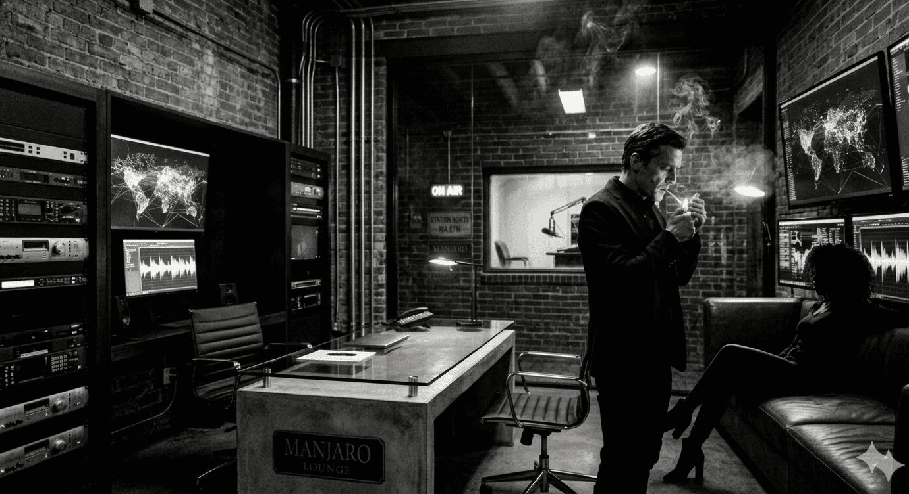 | 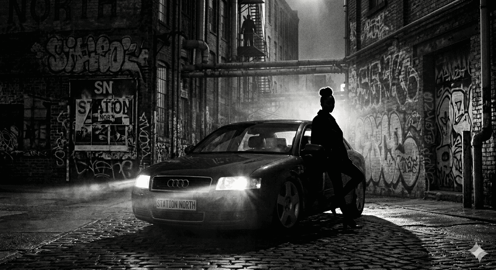 | 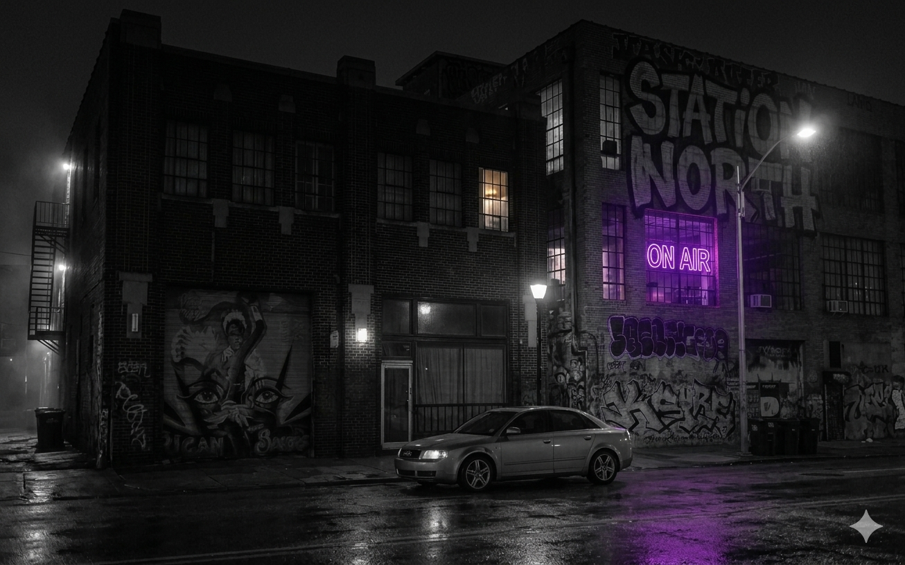 |

| 🎤 Queen Portrait I (Neon Night) | 💃 Queen Portrait II (Crimson Lounge) | ⚡ Queen Portrait III (Overclock Studio) |
| :---: | :---: | :---: |
| 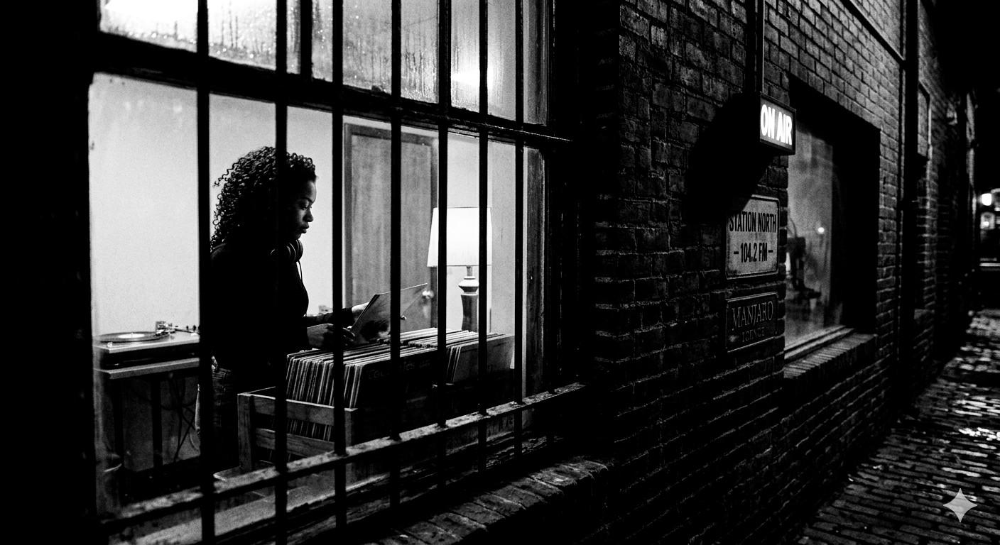 | 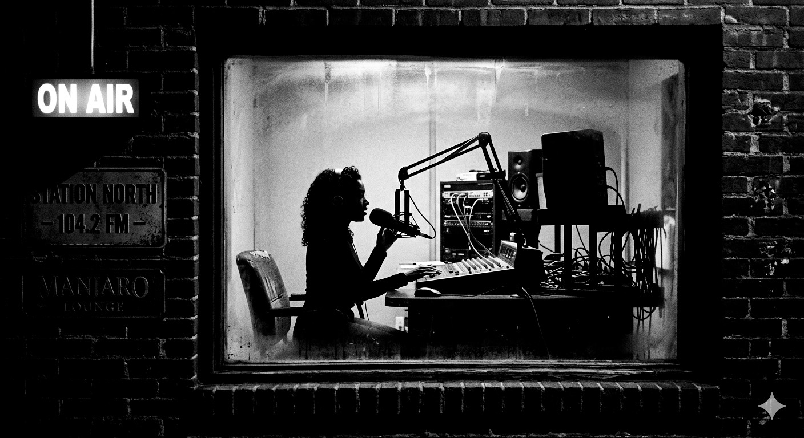 | 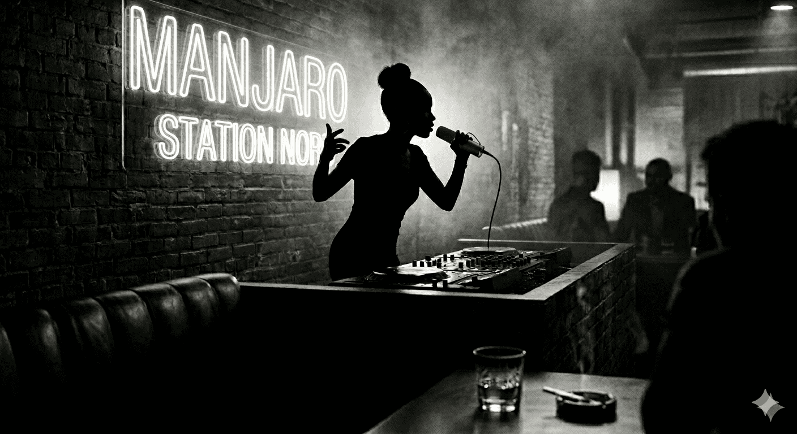 |

| 🎶 Queen Portrait IV (Velvet Signal) | 🔮 Queen Portrait V (Final Horizon) | 📻 The Vinyl Record Vault |
| :---: | :---: | :---: |
| 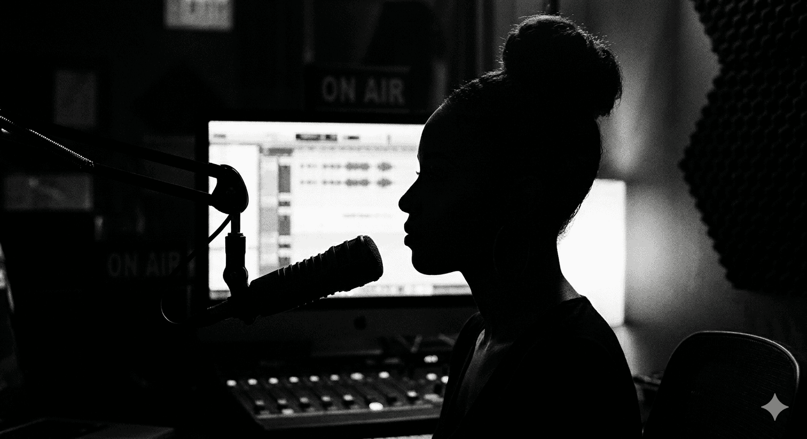 | 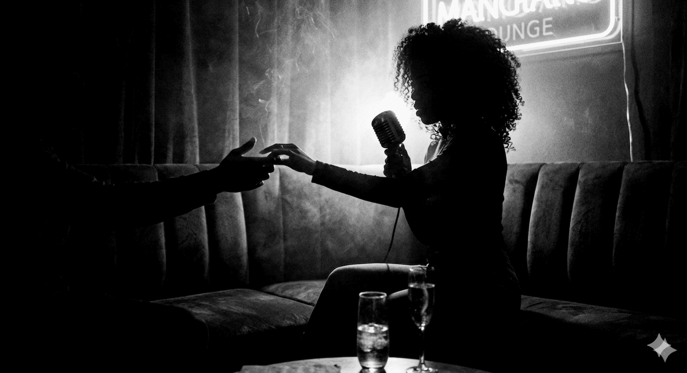 | 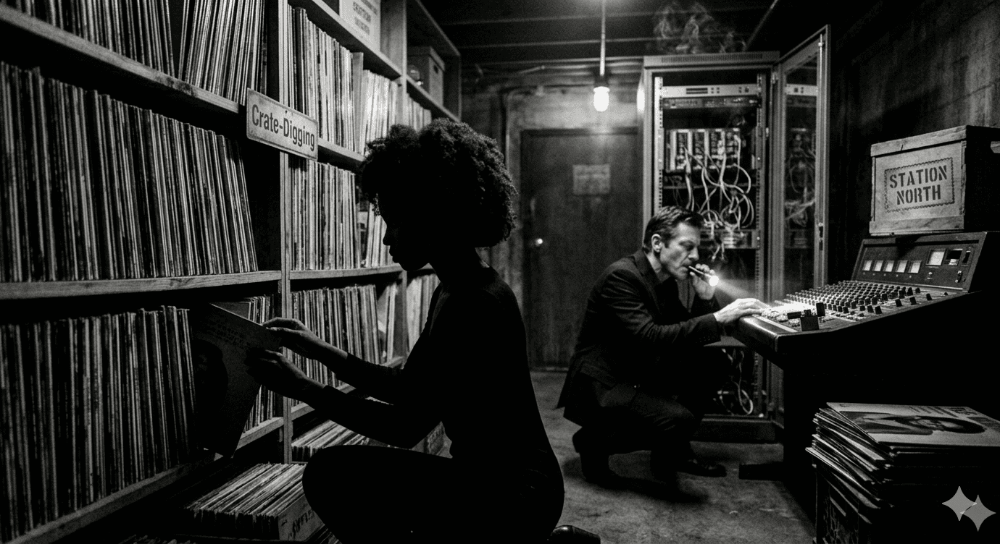 |

---

## 📺 Application UI Showcase

### 🖥️ Landscape & Android TV Layouts

| 📺 SN-TV Mode | 📻 SN-RADIO Mode |
| :---: | :---: |
| 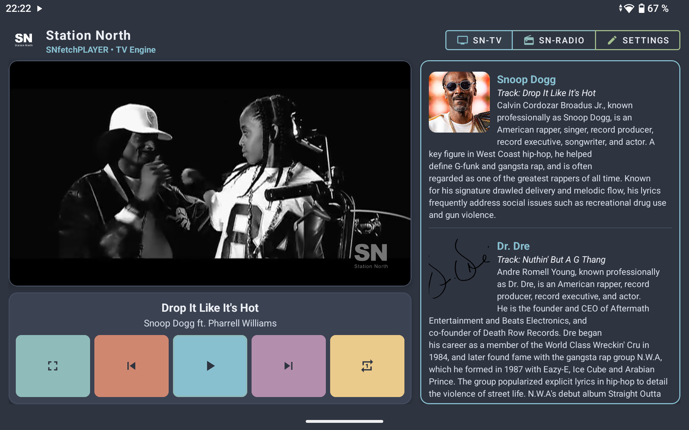 | 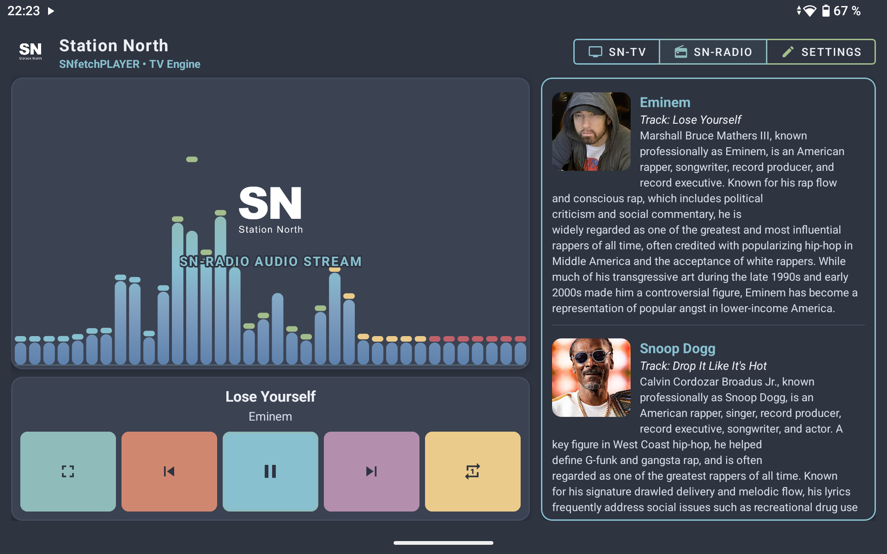 |

| 🛠️ Curator Studio | 📖 SN-Lexicon (4,438+ Artists) |
| :---: | :---: |
| 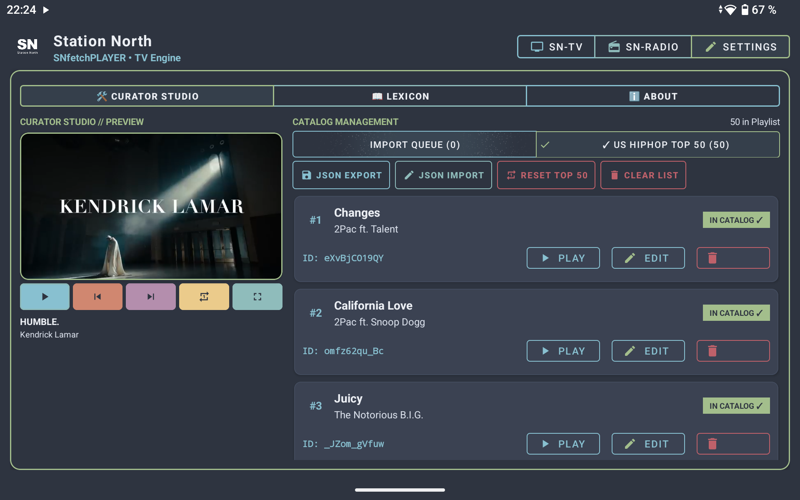 | 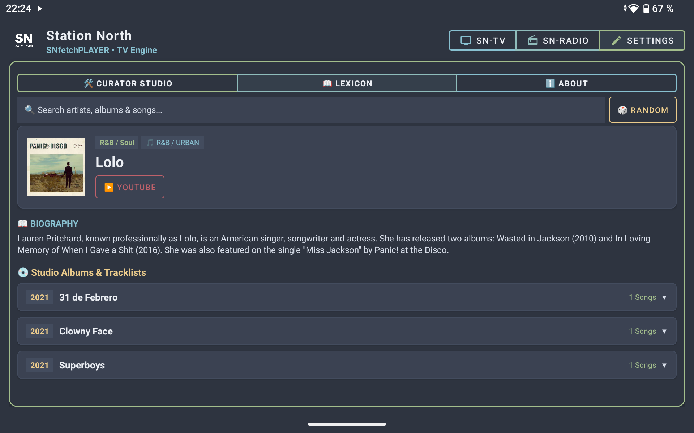 |

 

### 📱 Portrait & Smartphone Layouts

| 📺 SN-TV | 📻 SN-RADIO | 🛠️ Curator Studio | 📖 SN-Lexicon |
| :---: | :---: | :---: | :---: |
| 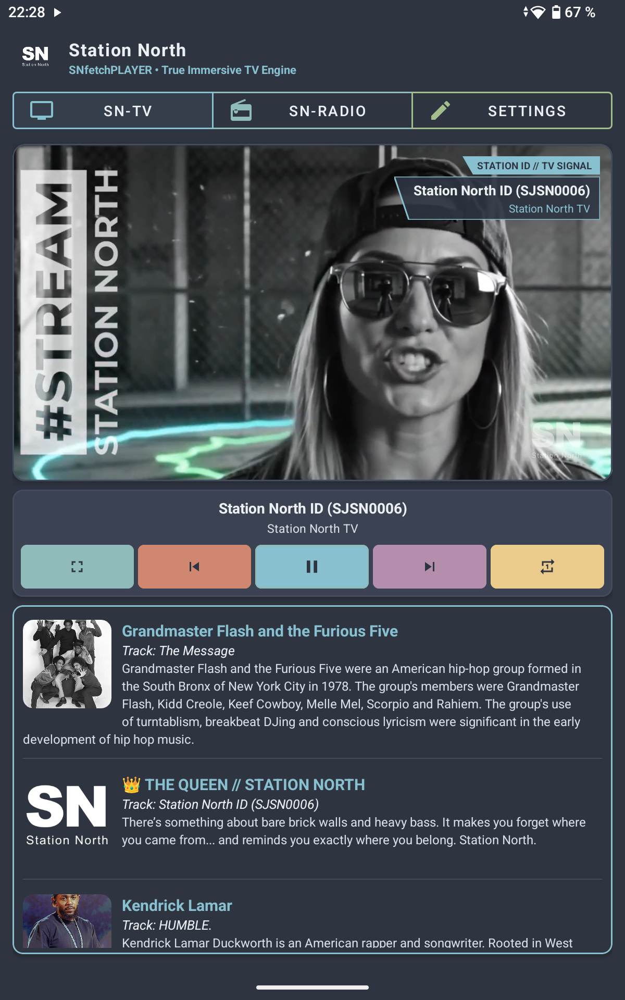 | 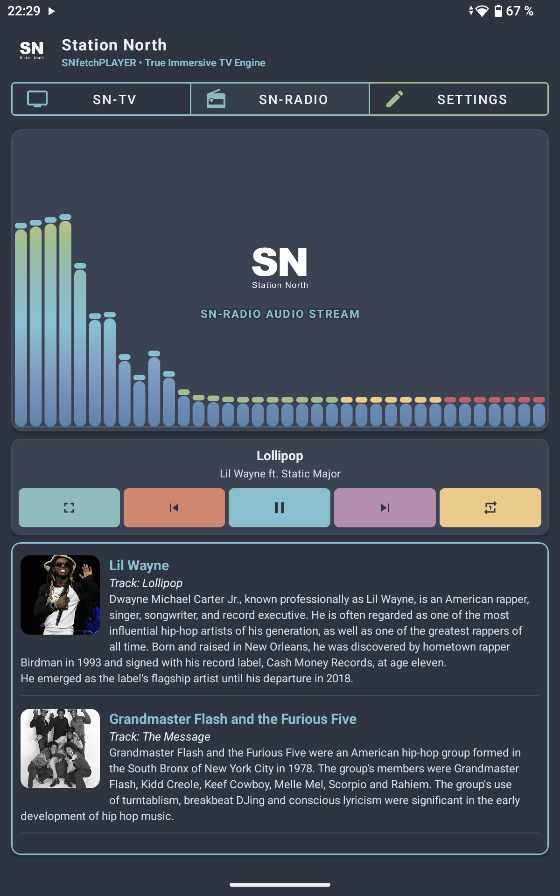 | 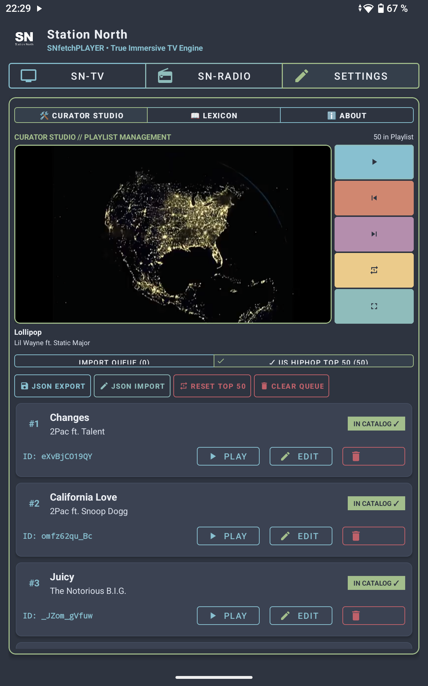 | 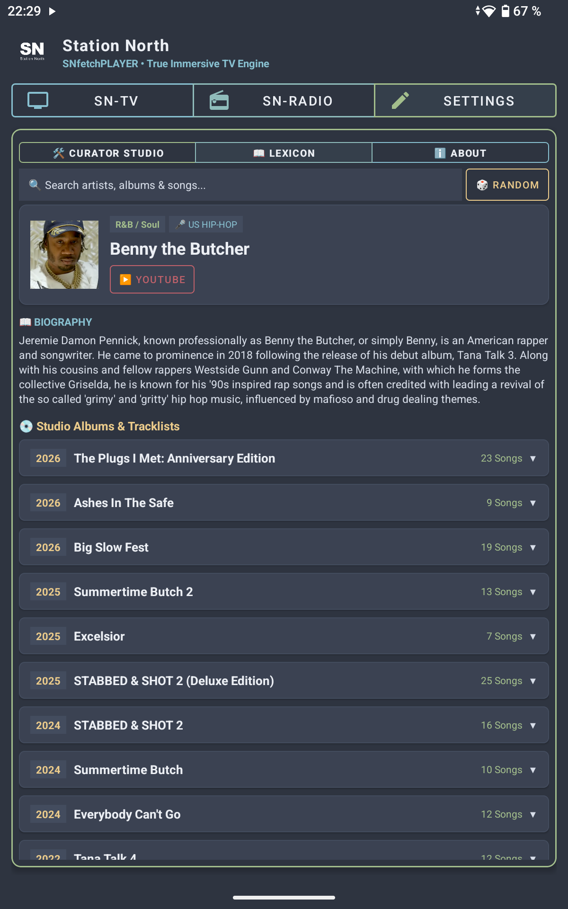 |

---

## 👑 Her Majesty's Feature Directives

### 📺 SN-TV (The Velvet Screen)
- **16:9 60 FPS Video Engine**: Powered by AndroidX Media3 ExoPlayer draped in custom slanted lower-third Bauchbinden displaying real-time track metadata and station branding.
- **HUD OSD Touch & D-Pad Control**: Full control bar with Exit Fullscreen, Track Skip, Play/Pause, and Loop toggles designed for both touchscreens and Android TV remotes.

### 📻 SN-RADIO (The Late Night Frequency)
- **60 FPS Real-Time FFT Visualizer**: Custom frequency spectrum bars vibrating in sync with deep 808s and raw R&B soul.
- **Dynamic Queen Quotes**: 59 Queen Quotes (`sprueche.json`) randomly chosen for station content, glowing in Station North Ambient highlight colors (Red, Orange, Yellow, Green, Purple).

### 🛠️ Curator Studio (The Command Center)
- **Default Main Mix (100 Hits)**: Pre-configured blend of US R&B Top 50 & US Hip-Hop Top 50 auto-loaded on launch.
- **YouTube Playlist Importer**: Paste any YouTube playlist link or ID to instantly extract and append video streams.
- **SN-Lexicon (4,438+ Entities)**: Deep music encyclopedia covering US Hip-Hop, R&B, and Urban Culture with discographies, tracklists, and biographies.

### 📡 Remote Asset Cloud Delivery
- **Background Sync Engine**: 163 audio jingles and 42 TV IDs lazily downloaded from the cloud in the background to keep the initial APK download lightweight.
- **Live Progress Bar**: Real-time asset download indicator located inside the Curator Studio **ℹ️ ABOUT** tab.

### 🌐 Community & Social Playlist Sharing
- **1,000 Ways to Share**: Export your custom-curated mixes and share them across forums, social media, Reddit, Discord, or directly with your crew.
- **Import Community Signals**: Paste playlist links, YouTube mixes, or JSON catalogs to instantly expand your personal Station North broadcast engine.

### 📖 The Manjaro Lounge Chronicles (In-App E-Book)
- **Full 6-Chapter Story**: Open the built-in fullscreen E-Book reader to discover how a girl from North Ave and a gray Audi V6 built an empire.

---

📖 <b>Click here to preview The Manjaro Lounge Chronicles with Artwork</b>

 

### Chapter 1: The Gray V6

Rain was coming down heavy that night, slicking the Baltimore asphalt like grease. I was standing on the corner of North Ave, collar up, minding my own damn business. Just another ghost in the neon fog, trying to survive the street...

Then that gray Audi B6 rolled up, slow and steady, hugging the curbs like it owned the block...

 

### Chapter 2: The Birth of the Frequency

He didn’t say much after that night, you know. The Boss ain't a man of big words—he lets his fingers do the talking on that mechanical keyboard, lines of blue code lighting up his face like a cold neon sign. But he let me stay at The Bricks...

 

### Chapter 3: The Queen's Territory

It didn’t take long for the streets to notice. When you change the pulse of a city, the old ghosts start getting restless...

 

### Chapter 4: The Sound of the Basement

The cellar of The Bricks was my playground. While the Boss spent his hours upstairs in the main hall—messing with those blinking towers and humming racks...

 

### Chapter 5: Guerrilla Grid

We didn’t advertise. We seduced. We didn’t wait for Baltimore to find us—we burned ourselves into the city's synapses until no one could tell where reality ended and our signal began...

 

### Chapter 6: The Overclock

I watch him through the glass. He’s sitting there, shoulders rigid, fingers dancing over the keyboard...

*(Read the full 6 Chapters directly inside the app's E-Book Reader)*

---

## 📥 Download & Installation

- 🐙 **GitHub Releases**: [https://github.com/StationNorthMedia/SNfetchPLAYER/releases](https://github.com/StationNorthMedia/SNfetchPLAYER/releases)
- 🦊 **GitLab Releases / Mirror**: [https://gitlab.com/station-north-net-group/snfetchplayer/-/tree/main/releases](https://gitlab.com/station-north-net-group/snfetchplayer/-/tree/main/releases)
- ⚡ **Direct APK Download**: [**`SNfetchPLAYER-v1.0.0.31.apk`**](https://github.com/StationNorthMedia/SNfetchPLAYER/releases/download/v1.0.0.31/SNfetchPLAYER-v1.0.0.31.apk) (70.5 MB)

1. Download the APK file on your Android device or TV box.
2. Install the APK and launch **SNfetchPLAYER**!

---

## 📄 License & Credits

Built with ❤️ by [**StationNorthMedia**](https://station-north.net). Distributed under the [MIT License](LICENSE).

---

## 🏷️ Indexing & Keyword Classification

`Android TV Player` • `Android Radio Player` • `ExoPlayer Engine` • `SmartTube Integration` • `YouTube Media Streaming` • `Real-Time FFT Audio Visualizer` • `Nord Theme UI` • `Open Source APK Download` • `Station North TV & Radio` • `R&B & Hip-Hop Curator Studio` • `Android Sideload APK` • `21:9 Ultra-Wide Video Player` • `Immersive Media Engine`

