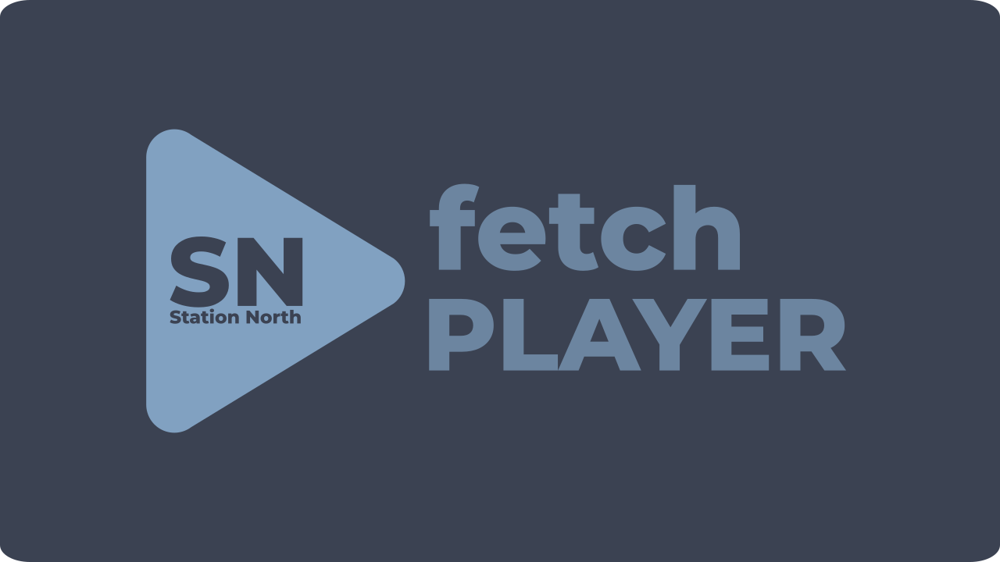

# 👑 SNfetchPLAYER • The Queen's Frequency
**Version 1.0.0.4 • Broadcast & Audio Engine for Android Smartphones, Tablets & Android TV**

---

### *"Drop the tempo, turn up the bass, and leave your shoes at the door."*

> [!NOTE]
> **A Message from Her Majesty The Queen:**  
> *"You’re not just looking at a code repository—you’ve stepped straight into The Bricks. The Boss built this machine with cold silicon, raw algorithms, and lines of blue code. But I am the soul that makes it breathe. Welcome to Station North."*

---

## 📸 Visual Gallery & Previews

| 📺 SN-TV (MTV Mode) | 📻 SN-RADIO (Audio Mode) |
| :---: | :---: |
|  |  |

---

## 👑 Her Majesty's Feature Directives

### 📺 SN-TV (The Velvet Screen)
- **16:9 60 FPS Video Engine**: Powered by AndroidX Media3 ExoPlayer draped in custom slanted lower-third Bauchbinden displaying real-time track metadata and station branding.
- **HUD OSD Touch & D-Pad Control**: Full control bar with Exit Fullscreen, Track Skip, Play/Pause, and Loop toggles designed for both touchscreens and Android TV remotes.

### 📻 SN-RADIO (The Late Night Frequency)
- **60 FPS Real-Time FFT Visualizer**: Custom frequency spectrum bars vibrating in sync with deep 808s and raw R&B soul.
- **Dynamic Queen Quotes**: 59 Queen Quotes (`sprueche.json`) randomly chosen for station content, glowing in Station North Ambient highlight colors (Red, Orange, Yellow, Green, Purple).

### 🛠️ Curator Studio (The Command Center)
- **Default Main Mix (100 Hits)**: Pre-configured blend of US R&B Top 50 & US Hip-Hop Top 50 auto-loaded on launch.
- **YouTube Playlist Importer**: Paste any YouTube playlist link or ID to instantly extract and append video streams.
- **SN-Lexicon (4,438+ Entities)**: Deep music encyclopedia covering US Hip-Hop, R&B, and Urban Culture with discographies, tracklists, and biographies.

### 📡 Remote Asset Cloud Delivery
- **Background Sync Engine**: 163 audio jingles and 42 TV IDs lazily downloaded from the cloud in the background to keep the initial APK download lightweight.
- **Live Progress Bar**: Real-time asset download indicator located inside the Curator Studio **ℹ️ ABOUT** tab.

### 📖 The Manjaro Lounge Chronicles (In-App E-Book)
- **Full 6-Chapter Story**: Open the built-in fullscreen E-Book reader to discover how a girl from North Ave and a gray Audi V6 built an empire.

---

📖 <b>Click here to preview Chapter 1 of The Manjaro Lounge Chronicles</b>

 

### Chapter 1: The Gray V6

Rain was coming down heavy that night, slicking the Baltimore asphalt like grease. I was standing on the corner of North Ave, collar up, minding my own damn business. Just another ghost in the neon fog, trying to survive the street...

Then that gray Audi B6 rolled up, slow and steady, hugging the curbs like it owned the block. The window rolled down. No cheap talk. No sleazy smile. He looked right through me, but not like the others. This European dude looked like he was searching for something real in the mud. A queen, not a quick game...

*(Read the full 6 Chapters directly inside the app's E-Book Reader)*

---

## 📥 Download & Installation

1. Download **[`SNfetchPLAYER-v1.0.0.4.apk`](https://github.com/StationNorthMedia/SNfetchPLAYER/releases/latest)** (73.1 MB) from GitHub Releases.
2. Install the APK on your Android Smartphone, Tablet, or Android TV Box.
3. Launch **SNfetchPLAYER** and let the Queen take over!

---

## 📄 License & Credits

Built with ❤️ by **StationNorthMedia**. Distributed under the [MIT License](LICENSE).
