

# 👑 SNfetchPLAYER • The Queen's Frequency
**Version 1.0.0.41 • Broadcast & Audio Engine for Android Smartphones, Tablets & Android TV**

---

### *"Drop the tempo, turn up the bass, and leave your shoes at the door."*

> [!IMPORTANT]
> **👑 A Manifesto from Her Majesty The Queen:**  
> *"Listen up, sunshine. You didn’t stumble onto just another code repository—you’ve stepped straight into the heart of Station North. This isn’t a closed broadcast tower where suits tell you what to listen to. **This is YOUR station.**  
> 
> The Boss built the engine out of cold silicon and raw algorithms, but **YOU hold the curator keys**. Want to run your own 24/7 TV & Radio broadcast? Want to build custom mixes, import YouTube playlists, explore 4,438+ Urban & R&B legends, and drop your own late-night frequency? We gave you the full command deck, 60 FPS real-time visualizers, remote asset sync, and every single tool you need to take over the airwaves.  
> 
> Build your catalog. Share your curated mixes across social media, forums, or with your crew. Curate your signal. Be a part of Station North."*

---

## 🏛️ The Station North Universe & Queen Gallery

| 👑 The Queen & The Boss | 🚘 The Gray V6 on North Ave | 🏢 The Bricks Headquarters |
| :---: | :---: | :---: |
| 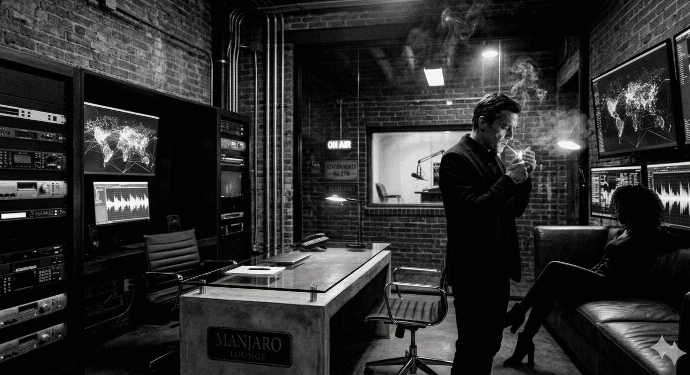 |  | 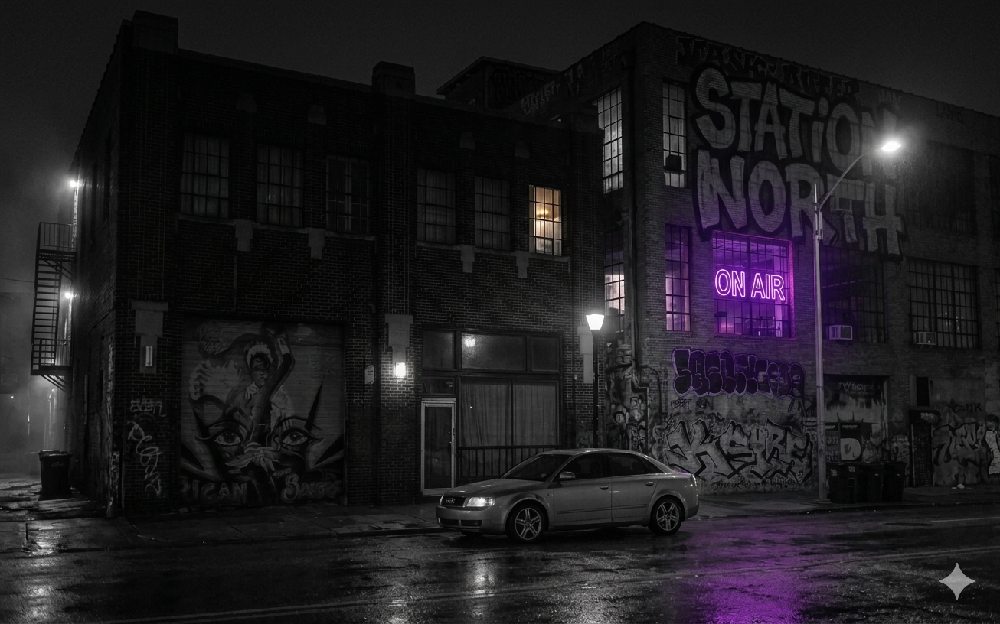 |

| 🎤 Queen Portrait I (Neon Night) | 💃 Queen Portrait II (Crimson Lounge) | ⚡ Queen Portrait III (Overclock Studio) |
| :---: | :---: | :---: |
| 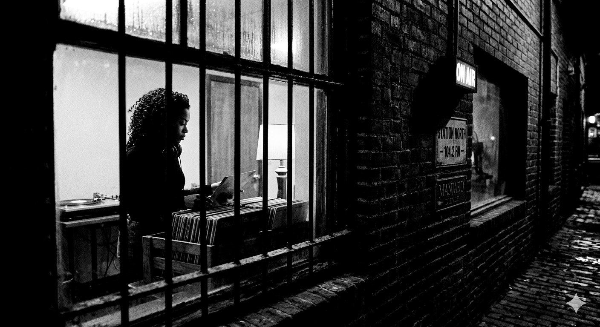 | 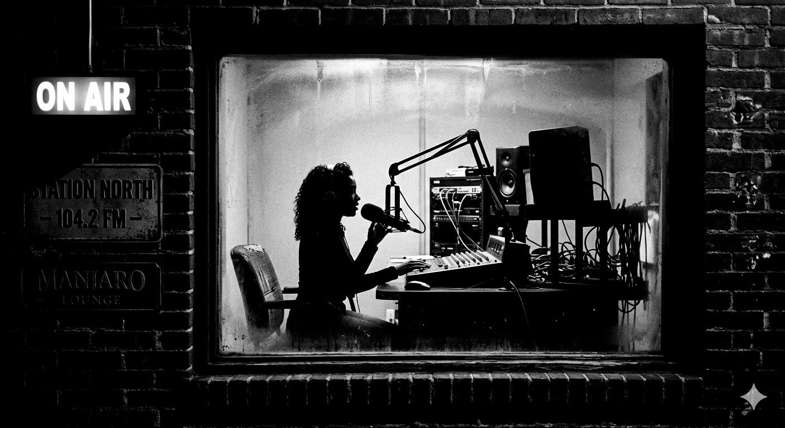 | 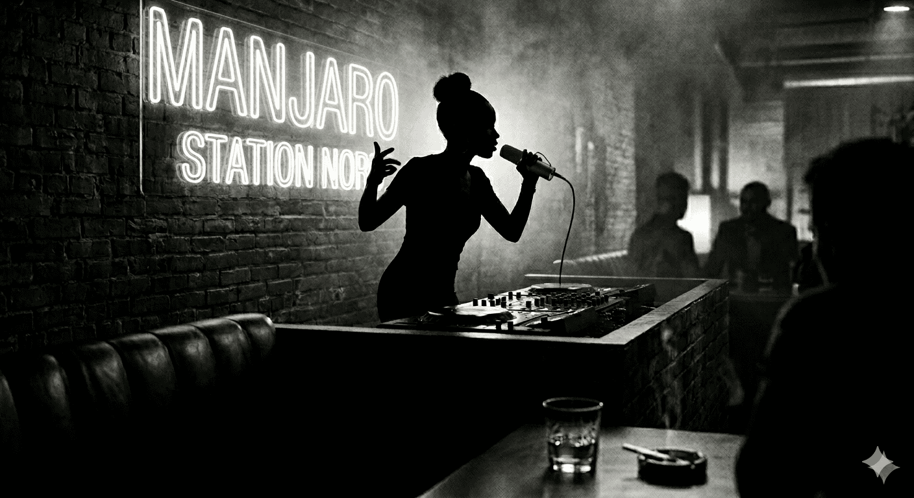 |

| 🎶 Queen Portrait IV (Velvet Signal) | 🔮 Queen Portrait V (Final Horizon) | 📻 The Vinyl Record Vault |
| :---: | :---: | :---: |
| 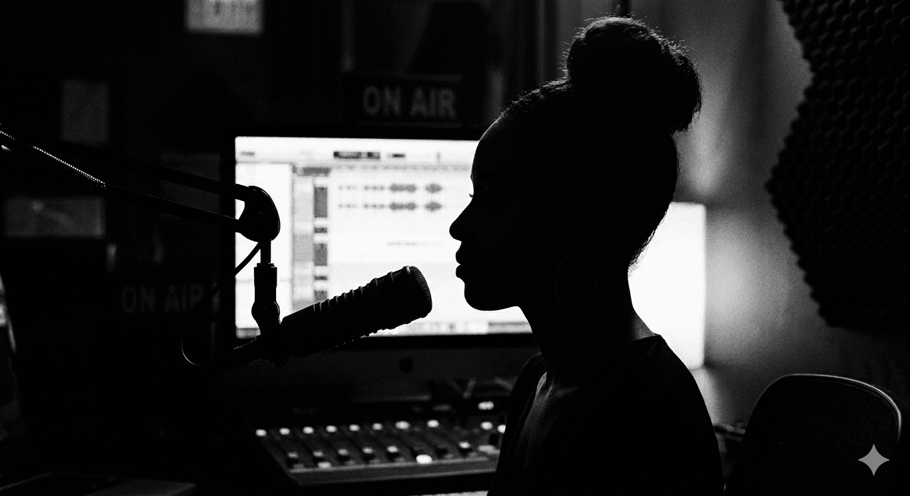 |  | 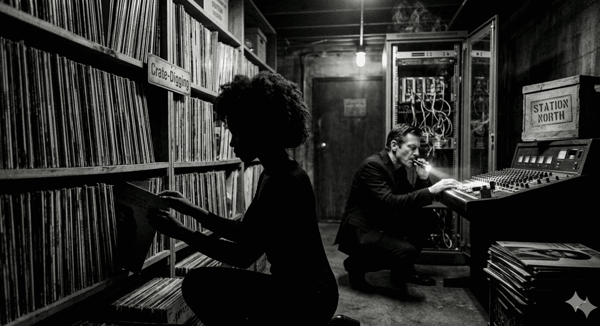 |

---

## 📺 Application UI Showcase

### 🖥️ Landscape & Android TV Layouts

| 📺 SN-TV Mode | 📻 SN-RADIO Mode |
| :---: | :---: |
| 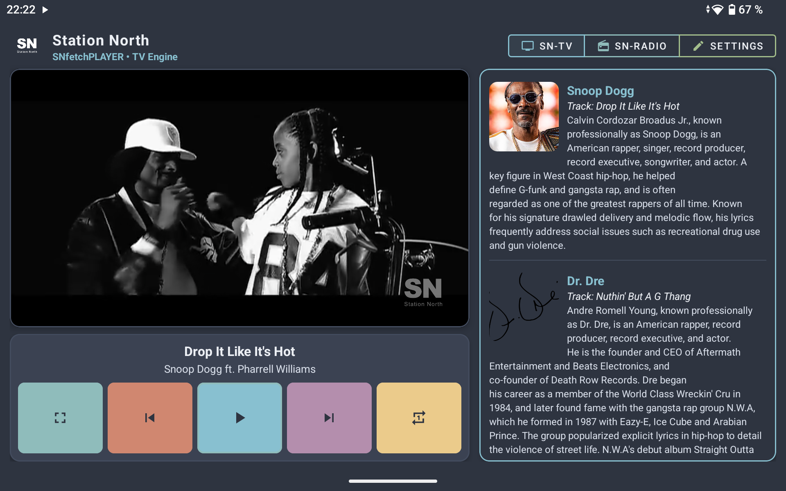 | 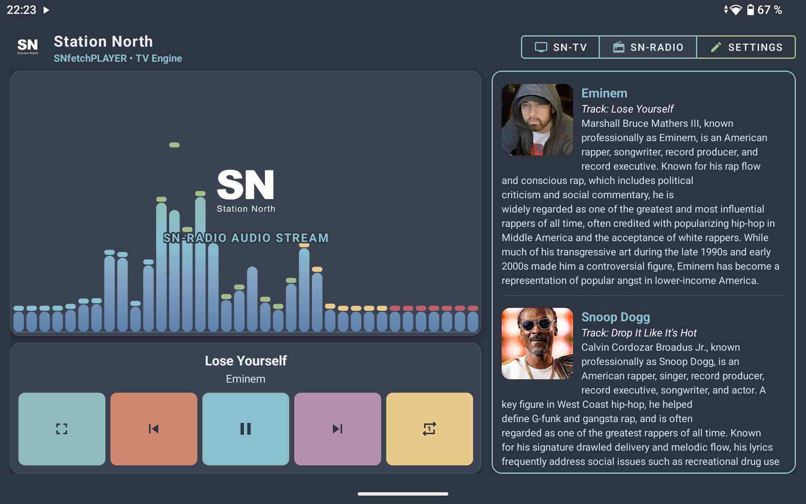 |

| 🛠️ Curator Studio | 📖 SN-Lexicon (4,438+ Artists) |
| :---: | :---: |
| 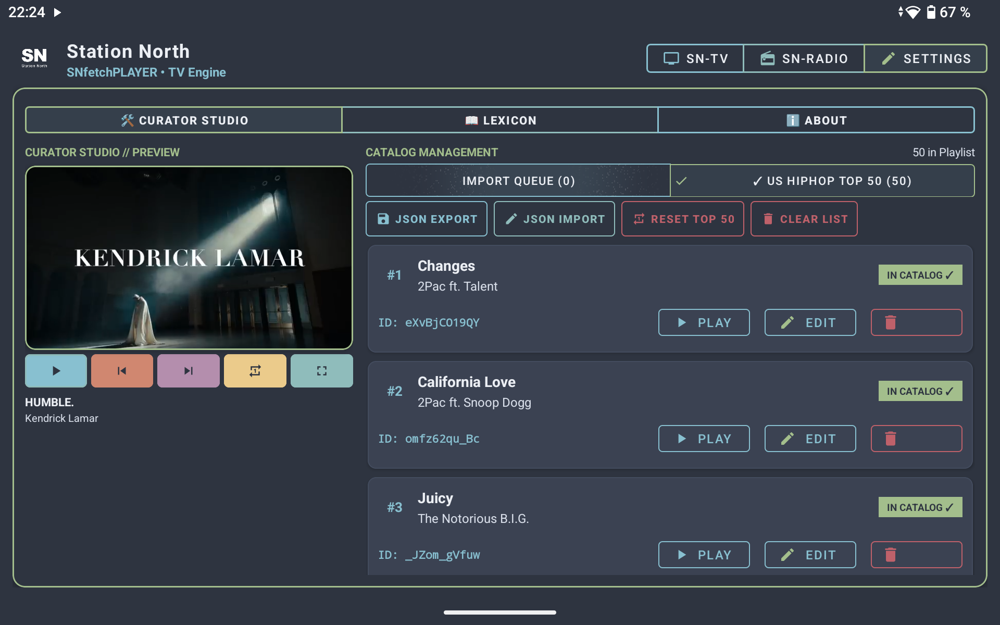 | 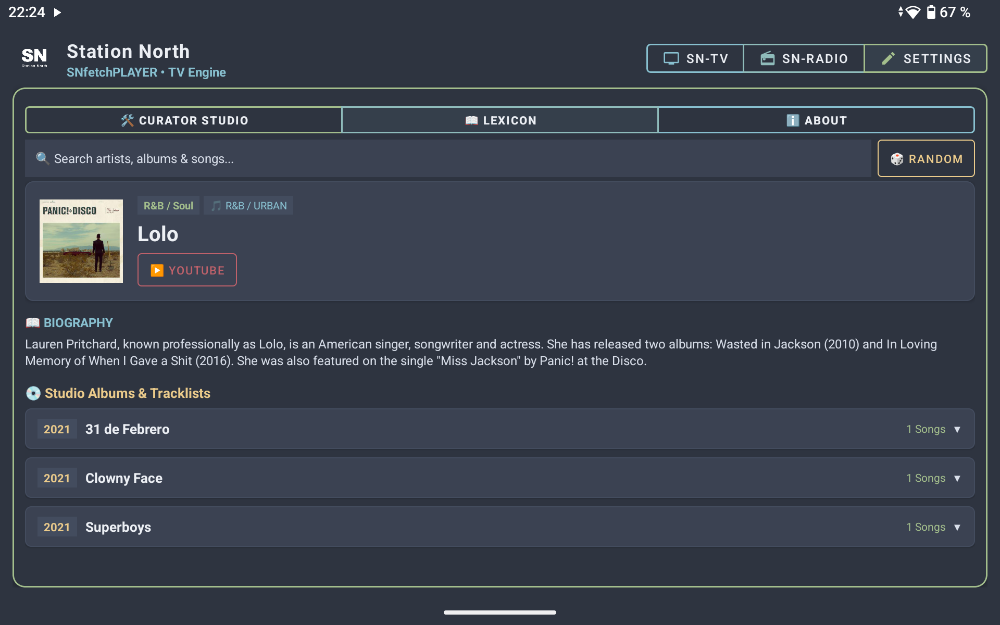 |

 

### 📱 Portrait & Smartphone Layouts

| 📺 SN-TV | 📻 SN-RADIO | 🛠️ Curator Studio | 📖 SN-Lexicon |
| :---: | :---: | :---: | :---: |
| 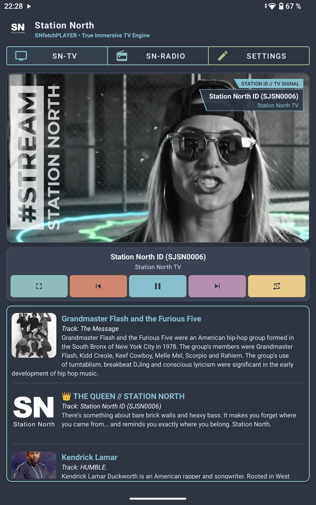 | 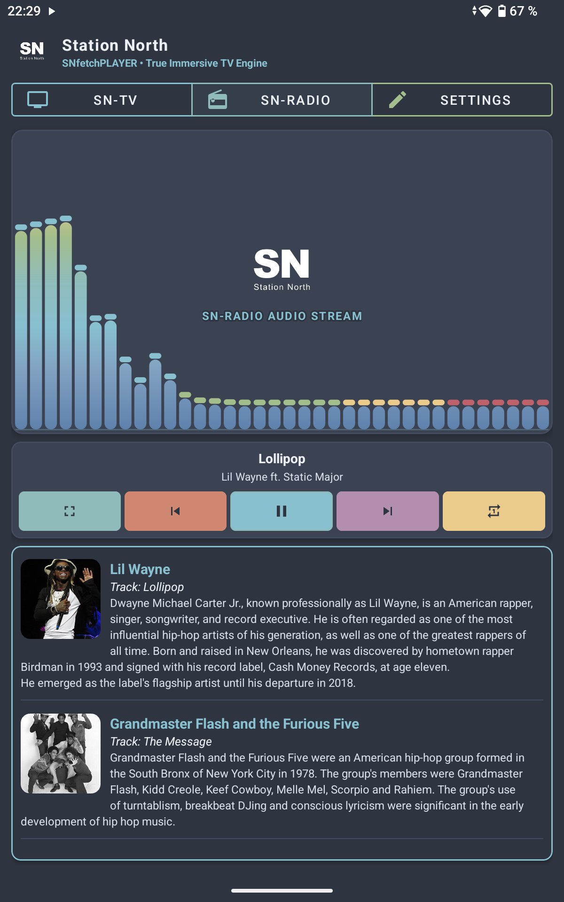 | 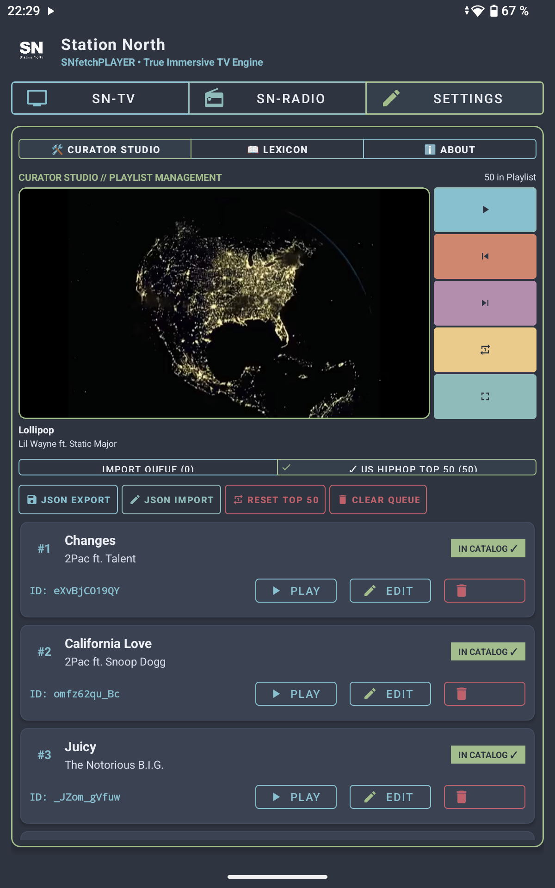 | 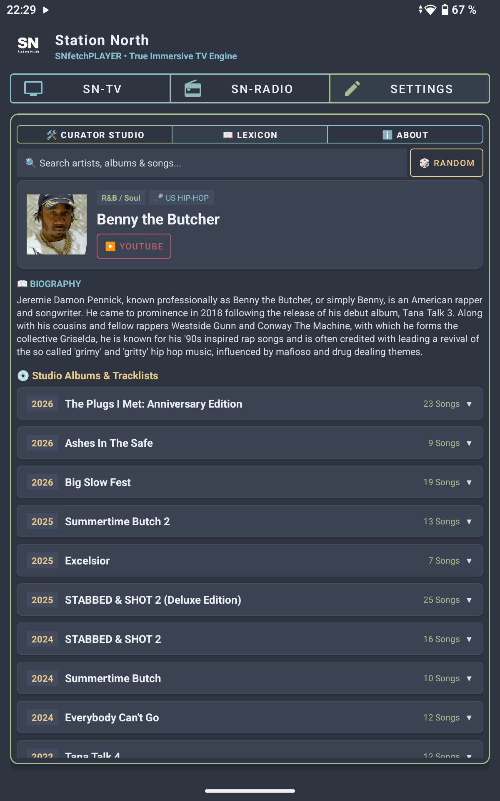 |

---

## 👑 Her Majesty's Feature Directives

### 📺 SN-TV (The Velvet Screen)
- **16:9 60 FPS Video Engine**: Powered by AndroidX Media3 ExoPlayer draped in custom slanted lower-third Bauchbinden displaying real-time track metadata and station branding.
- **HUD OSD Touch & D-Pad Control**: Full control bar with Exit Fullscreen, Track Skip, Play/Pause, and Loop toggles designed for both touchscreens and Android TV remotes.

### 📻 SN-RADIO (The Late Night Frequency)
- **60 FPS Real-Time FFT Visualizer**: Custom frequency spectrum bars vibrating in sync with deep 808s and raw R&B soul.
- **Dynamic Queen Quotes**: 59 Queen Quotes (`sprueche.json`) randomly chosen for station content, glowing in Station North Ambient highlight colors (Red, Orange, Yellow, Green, Purple).

### 🛠️ Curator Studio (The Command Center)
- **Default Main Mix (100 Hits)**: Pre-configured blend of US R&B Top 50 & US Hip-Hop Top 50 auto-loaded on launch.
- **YouTube Playlist Importer**: Paste any YouTube playlist link or ID to instantly extract and append video streams.
- **SN-Lexicon (4,438+ Entities)**: Deep music encyclopedia covering US Hip-Hop, R&B, and Urban Culture with discographies, tracklists, and biographies.

### 📡 Remote Asset Cloud Delivery
- **Background Sync Engine**: 163 audio jingles and 42 TV IDs lazily downloaded from the cloud in the background to keep the initial APK download lightweight.
- **Live Progress Bar**: Real-time asset download indicator located inside the Curator Studio **ℹ️ ABOUT** tab.

### 🌐 Community & Social Playlist Sharing
- **1,000 Ways to Share**: Export your custom-curated mixes and share them across forums, social media, Reddit, Discord, or directly with your crew.
- **Import Community Signals**: Paste playlist links, YouTube mixes, or JSON catalogs to instantly expand your personal Station North broadcast engine.

### 🐳 Self-Hosted Private `yt-dlp` Extractor & Multi-Choice Pipelines
- **Multi-Choice Source Selector**: Module 8 (Settings Hub) lets you toggle individual extraction sources (Native InnerTube, Station North Cloud, Private `yt-dlp` API, Invidious, Cobalt, Piped) with custom URL fields and real-time **Test Connection** latency benchmarking.
- **Turn-Key Portainer Stack**: Deploy your own 24/7 private extraction server via Docker/Portainer ([`docker/Portainer-Stack.yml`](docker/Portainer-Stack.yml)) featuring an automatic **12-hour Watchdog background updater** for `yt-dlp` and optional Cloudflare Zero Trust SSL tunnel integration.
- **Setup Guide**: Read [`docs/PRIVATE_EXTRACTOR_SETUP.md`](docs/PRIVATE_EXTRACTOR_SETUP.md) or open the in-app setup guide directly from Module 8!

### 📖 The Manjaro Lounge Chronicles (Vol. 01 - Native Inline E-Book Reader)
- **Complete Native Story Engine**: The full **13 Chapters & 98 Paragraphs** of *The Manjaro Lounge Chronicles (Vol. 01)* integrated **directly inline** inside **Settings > Chronicles** (Module 6).
- **44 Comic Artworks (WebP Optimized)**: High-resolution artwork panels compressed with WebP technology (87% size optimization, keeping APK size lightweight at ~116 MB).
- **98 Audio Narrative Chapters**: Synchronized audio playback for every paragraph with individual Play/Pause buttons, SeekBars, time indicators, and continuous auto-advance (`Track i -> i + 1`).
- **16:9 Landscape / Widescreen Side-by-Side Layout**: On horizontal/TV screens, comic panels render on the left (40%) and narrative text + player controls render on the right (60%) for optimal reading comfort.
- **Activity Lifecycle Protection**: Audio automatically pauses on app minimize (`onPause` / `onStop`), module switch, or activity destruction (`onDestroy`).

---

## 📥 Download & Installation

- 🐙 **GitHub Releases**: [https://github.com/StationNorthMedia/SNfetchPLAYER/releases](https://github.com/StationNorthMedia/SNfetchPLAYER/releases)
- 🦊 **GitLab Releases / Mirror**: [https://gitlab.com/station-north-net-group/snfetchplayer/-/tree/main/releases](https://gitlab.com/station-north-net-group/snfetchplayer/-/tree/main/releases)
- ⚡ **Direct APK Download**: [**`SNfetchPLAYER-v1.0.0.41.apk`**](https://github.com/StationNorthMedia/SNfetchPLAYER/releases/download/v1.0.0.41/SNfetchPLAYER-v1.0.0.41.apk) (71 MB)

1. Download the APK file on your Android device or TV box.
2. Install the APK and launch **SNfetchPLAYER**!

---

## 📄 License & Credits

Built with ❤️ by [**StationNorthMedia**](https://station-north.net). Distributed under the [MIT License](LICENSE).

---

## 🏷️ Indexing & Keyword Classification

`Android TV Player` • `Android Radio Player` • `ExoPlayer Engine` • `SmartTube Integration` • `YouTube Media Streaming` • `Real-Time FFT Audio Visualizer` • `Nord Theme UI` • `Open Source APK Download` • `Station North TV & Radio` • `R&B & Hip-Hop Curator Studio` • `Android Sideload APK` • `21:9 Ultra-Wide Video Player` • `Immersive Media Engine` • `Manjaro Lounge Chronicles E-Book`
